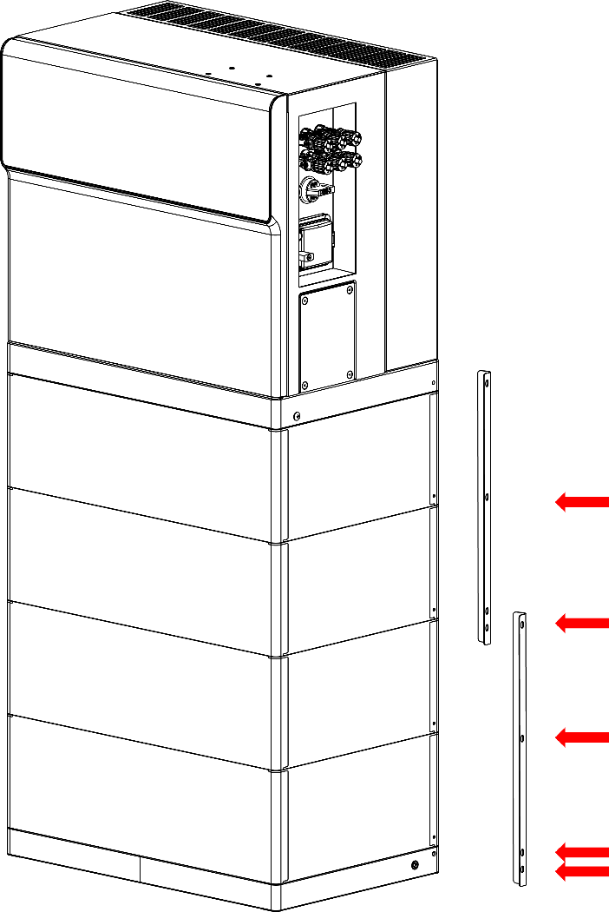

# Pylontech FH3X Modbus Protocol Reference

Quick-reference guide for the FH3X inverter/BMS Modbus TCP interface, filtered down to
the register tables and bit-field definitions needed to build an integration.

## Connection

- **Transport:** Modbus TCP only (no RTU/serial support).
- **Default IP:** `172.22.184.210`, **Port:** `502` (changeable via the vendor app).
- **MBAP header** (7 bytes) precedes the standard Modbus PDU (function code + data):

| Field | Size | Notes |
| --- | --- | --- |
| Transaction identifier | 2 bytes | High byte first; 0-65535; echoed back by the slave to match requests/responses. |
| Protocol identifier | 2 bytes | Fixed `0x0000` (Modbus). |
| Length | 2 bytes | High byte first; byte count from Unit identifier to end of PDU. |
| Unit identifier | 1 byte | Slave address (1-N); echoed back by the slave. |

## Addressing overview

The device exposes two separate register maps, selected by **slave/unit address**:

- **Address 1** — Battery pile / ESS (BMS) data. See [Address 1 register data](#address-1-register-data).
- **Address 2** — Inverter (PCS) data: device info, monitoring, settings, energy
 management. All registers at address 2 are read/write capable. See
 [Address 2 register data](#address-2-register-data).

---

## Address 1 register data

### 1.1 Equipment Information

|  |  |  |  |
| --- | --- | --- | --- |
| Register | Read/Write | Content | Remark |
| 0x100A | RO | 0x0106 | Main version 01; subversion 06, then V1.6 |
| 0x101E | RO | 0x0101 | HMI version; V1.1 |

### 1.2 Remote Control Information

|  |  |  |  |
| --- | --- | --- | --- |
| Register | Read/Write | Content | Remark |
| 0x1095 | RW | Unlock faulty lockup. | 0xAA: effective Others: NULL |
| 0x10E0 | RW | Year | 00~99 (mean 2000~2099) |
| 0x10E1 | RW | Month | 1~12 |
| 0x10E2 | RW | Day | 1~31 |
| 0x10E3 | RW | Hour | 0~23 |
| 0x10E4 | RW | Minute | 0~59 |
| 0x10E5 | RW | Second | 0~59 |

### 1.3 Single ESS Information

Address = ESS base address in the address table + the offset address in table blow

e.g.: total voltage of ESS1

the address is: 0x1400+0x0003:

|  |  |  |  |  |
| --- | --- | --- | --- | --- |
| Offset Address | Read/Write | Content | Unit | Remark |
| 0x000 | RO | Basic Status |  | See Appendix I -1 |
| 0x001 | RO | Protect Information |  | See Appendix I - 2 |
| 0x002 | RO | Alarm status 1 |  | See Appendix I - 3 |
| 0x003 | RO | Total Voltage | 0.1V |  |
| 0x004- 0x005 | RO | Current | 0.01A | If it is negative, uses complement to show it. 4 bytes. |
| 0x006 | RO | Temperature | 0.1 ̊C | If it is negative, uses complement to show it. |
| 0x007 | RO | SOC | 1% |  |
| 0x008 | RO | Cycle time |  |  |
| 0x0009 | RO | Max charge voltage of pile | 0.1V |  |
| 0x000A-0x000B | RO | Max charge current of pile | 0.01A |  |
| 0x000C | RO | Min discharge voltage of pile | 0.1V |  |
| 0x000D-0x000E | RO | Max discharge current of pile | 0.01A | If it is negative, uses complement to show it. |
| 0x000F | RO | Switching value |  | Appendix II |
| 0x0010 | RO | Max cell voltage | 0.001V |  |
| 0x0011 | RO | Min cell voltage | 0.001V |  |
| 0x0012 | RO | Serial number of max cell voltage channel |  |  |
| 0x0013 | RO | Serial number of min cell voltage channel |  |  |
| 0x0014 | RO | Max cell temperature | 0.1℃ | If it is negative, uses complement to show it. |
| 0x0015 | RO | Min cell temperature | 0.1℃ | If it is negative, uses complement to show it. |
| 0x0016 | RO | Serial number of max cell temperature channel |  |  |
| 0x0017 | RO | Serial number of min cell temperature channel |  |  |
| 0x0018 | RO | Max module voltage | 0.01V |  |
| 0x0019 | RO | Min module voltage\* | 0.01V |  |
| 0x001A | RO | Serial number of max module voltage channel |  |  |
| 0x001B | RO | Serial number of min module voltage channel |  |  |
| 0x001C | RO | Max module temperature | 0.1℃ | If it is negative, uses complement to show it. |
| 0x001D | RO | Min module temperature | 0.1℃ | If it is negative, uses complement to show it. |
| 0x001E | RO | Serial number of max module temp channel. |  |  |
| 0x001F | RO | Serial number of min module temp channel. |  |  |
| 0x0020 | RO | SOH | 1% | Maximum Discharge Capacity Percentage |
| 0x0021~ 0x0022 | RO | Remain capacity | Wh |  |
| 0x0027~ 0x0028 | RO | Daily accumulate charge capacity | Wh |  |
| 0x0029~ 0x002A | RO | Daily accumulate discharge capacity | Wh |  |
| 0x002B~ 0x002C | RO | History accumulate charge capacity | KWh |  |
| 0x002D~ 0x002E | RO | History accumulate discharge capacity | KWh |  |
| 0x002F | RO | BMS Force charge request mark |  | 1: request; 0: Null |
| 0x0030 | RO | full charge request mark |  | 1: request; 0: Null |
| 0x0032~ 0x0033 | RO | Error code 1 |  | 0: Null; other: code number See Appendix IV for more details |
| 0x0034~ 0x0035 | RO | Error code 2 |  | 0: Null; other: code number |
| 0x0036 | RO | Module number in series |  |  |
| 0x0037 | RO | Cell number in series |  |  |
| 0x0038 | RO | BMS Charge forbidden mark |  | 1: request; 0: Null |
| 0x0039 | RO | BMS Discharge forbidden mark |  | 1: request; 0: Null |
| 0x0049 | RO | Alarm status 2 |  | See Appendix I-4 |
| 0x0050~ 0x005F | RO | SN code |  | Totally 16 addresses, support max 32 ASCII code; if less than 32, use 0x00 |
| 0x0100~ 0x02C1 | RO | Voltage of cell number 000~449 | 0.001V | Max 450 cells in series |
| 0x0668 | RO | VB | 0.1V | Voltage between B+ and B- |
| 0x0669~ 0x0686 | RO | Each bit represents the balancing status of a cell. Each register tracks 16 battery cells: 0x0669[bit0-bit15] → Cells 0-15 0x066A[bit0-bit15] → Cells 16-31 Continue adding registers following this pattern. |  | 0: Balance status OFF 1: Balance statuc ON |

\* As shown in the figure below, for a stacked system, module #0 is the bottom module and cell #0 is the leftmost cell (viewed from the front).

From bottom to top corresponds to module 0

From left to right corresponds to cell 0 to 31

---

## Address 2 register data

**Use address 2 to access the following information. All registers are RW capable
regardless of their logical read/write intent.**

### Device Information

|  |  |  |  |  |  |  |  |
| --- | --- | --- | --- | --- | --- | --- | --- |
| Register Address | HEX 16 | Register Name | Byte | Format | Description& instruction & | Default value | Read/Write |
| 30010 | 753A | Manufacturer Name | 16 | ASCII\*16 |  |  | RO |
| 30018 | 7542 | Model Name | 16 | ASCII\*16 |  |  | RO |
| 30026 | 754A | Serial Number | 16 | ASCII\*16 |  |  | RO |
| 30039 | 7557 | Software Version | 4 | U8\*4 | V x.x.x.x |  | RO |
| 30045 | 755D | Safety type | 2 | U16 | Appendix VII | 5 | RO |
| 30055 | 7567 | Parallel Mode | 2 | U16 | 0: Independent system 1: Parallel system mode:master 2: Parallel system mode:slave |  | RO |
| 30056 | 7568 | Parallel Address | 2 | U16 | Parallel mode slave address |  | RO |
| 30061 | 756D | AFCI Firmware Version | 4 | U8\*4 | Vx.x.x.x |  | RO |
| 30063 | 756E | Serial number(E) | 16 | ASCII\*16 | Serial number Expansion |  | RO |
| 30071 | 7577 | Number of parallel machines | 2 | U16 |  |  | RO |

### Monitor Information & Statistics

|  |  |  |  |  |  |  |  |  |
| --- | --- | --- | --- | --- | --- | --- | --- | --- |
| Register Address | HEX 16 | Register Name | Byte | Unit | Format | Description& instruction & | Default value | Read/Write |
| 30100 | 7594 | AC Total P | 4 | W | S32 | Positive: Output Negative: Input | 0 | RO |
| 30102 | 7596 | AC Total S | 4 | VA | S32 | Positive: Output Negative: Input | 0 | RO |
| 30104 | 7598 | AC Total Q | 4 | VAR | S32 | Positive: Output Negative: Input | 0 | RO |
| 30106 | 759A | AC PF | 2 | 0.01 | U16 |  | 100 | RO |
| 30107 | 759B | AC Q/PF direction | 2 |  | U16 | 1: Lag 2: Lead |  | RO |
| 30108 | 759C | Grid Total Power | 4 | W | S32 | Positive: Import from Grid Negative: Export to Grid |  | RO |
| 30110 | 759E | Third party meter active power | 4 | W | U32 |  |  | RO |
| 30112 | 75A0 | Third party meter energy | 4 | KWH | Float32 |  |  |  |
| 30115 | 75A3 | Inverter state | 2 |  | U16 | 0: Wait 1: Normal 2: Fault |  | RO |
| 30116 | 75A4 | Waiting time | 2 | S | U16 | After the inverter is powered up, it needs to wait for some time before self-testing | 60s | RO |
| 30119 | 75A7 | PV1 voltage PV1 | 2 | 0.1V | U16 |  |  | RO |
| 30120 | 75A8 | PV1 current PV1 | 2 | 0.1A | U16 |  |  | RO |
| 30121 | 75A9 | PV2 voltage PV2 | 2 | 0.1V | U16 |  |  | RO |
| 30122 | 75AA | PV2 current PV2 | 2 | 0.1A | U16 |  |  | RO |
| 30123 | 75AB | PV3 voltage PV3 | 2 | 0.1V | U16 |  |  | RO |
| 30124 | 75AC | PV3 current PV3 | 2 | 0.1A | U16 |  |  | RO |
| 30127 | 75AF | PV total Power PV | 4 | W | S32 | W |  | RO |
| 30129 | 75B1 | PV total kWH PV | 4 | KWH | Float32 | KWH |  | RO |
| 30131 | 75B3 | AC R voltage R | 2 | 0.1V | U16 |  |  | RO |
| 30132 | 75B4 | AC R current R | 2 | 0.1A | U16 |  |  | RO |
| 30133 | 75B5 | AC S voltage S | 2 | 0.1V | U16 |  |  | RO |
| 30134 | 75B6 | AC S current S | 2 | 0.1A | U16 |  |  | RO |
| 30135 | 75B7 | AC T voltage T | 2 | 0.1V | U16 |  |  | RO |
| 30136 | 75B8 | AC T current T | 2 | 0.1A | U16 |  |  | RO |
| 30137 | 75B9 | AC Line Voltage RS R-S | 2 | 0.1V | U16 |  |  | RO |
| 30138 | 75BA | AC Line Voltage ST S-T | 2 | 0.1V | U16 |  |  | RO |
| 30139 | 75BB | AC Line Voltage TR T-R | 2 | 0.1V | U16 |  |  | RO |
| 30140 | 75BC | AC frequency | 2 | 0.01Hz | U16 |  |  | RO |
| 30141 | 75BD | BUS voltage | 2 | 0.1V | U16 |  |  | RO |
| 30142 | 75BE | ISO | 2 | Kohm | U16 |  |  | RO |
| 30143 | 75BF | DCI | 2 | mA | S16 |  |  | RO |
| 30144 | 75C0 | GFCI | 2 | mA | S16 |  |  | RO |
| 30145 | 75C1 | N PE voltage | 2 | 0.1V | S16 |  |  | RO |
| 30146 | 75C2 | Internal ambient temperature | 2 | 0.1℃ | S16 |  |  | RO |
| 30147 | 75C3 | Internal heatsink temperature | 2 | 0.1℃ | S16 |  |  | RO |
| 30148 | 75C4 | Fault(Bit) | 4 |  | U32 | Appendix VIII |  | RO |
| 30150 | 75C6 | Warning(Bit) | 4 |  | U32 | Appendix IX |  | RO |
| 30152 | 75C8 | Firmware Update Sate | 2 |  | U16 | 0: Idle 1: Download finished 2: Update finished |  | RO |
| 30153 | 75C9 | Internal boost-module temperature | 2 | 0.1℃ | S16 |  |  | RO |
| 30154 | 75CA | E-total of AC Output | 4 | kWh | Float32 |  |  | RO |
| 30156 | 75CC | Import Energy from Grid (meter) | 4 | kWh | Float32 |  |  | RO |
| 30158 | 75CE | Export Energy to Grid (meter) | 4 | kWh | Float32 |  |  | RO |
| 30160 | 75D0 | AC Output Substate | 2 |  | Enum16 | 0: Null 1: Normal at Grid tied mode 2: Normal at Back up mode |  | RO |
| 30161 | 75D1 | Battery State | 2 |  | Enum16 | Battery status 0: Sleep 1: Charging 2: Discharging 3: Idle 4: Standby 5: Run 6: Fault 7: Offline |  | RO |
| 30162 | 75D2 | Battery charge/discharge power | 4 | W | S32 | Positive: Discharge Negative: Charge |  | RO |
| 30164 | 75D4 | Battery Voltage | 2 | 0.1V | U16 |  |  | RO |
| 30165 | 75D5 | Battery charge/discharge current | 2 | 0.1A | S16 | Positive: Discharge Negative: Charge |  | RO |
| 30166 | 75D6 | Charge forbidden mask | 2 |  | U16 |  |  | RO |
| 30167 | 75D7 | Discharge forbidden mask | 2 |  | U16 |  |  | RO |
| 30168 | 75D8 | Forced charge request | 2 |  | U16 |  |  | RO |
| 30170 | 75DA | EPS Volt EPS | 2 | 0.1V | U16 |  |  | RO |
| 30171 | 75DB | EPS Freq EPS | 2 | 0.01Hz | U16 |  |  | RO |
| 30172 | 75DC | EPS Total Power EPS | 4 | W | S32 | Positive: Output Negative: Input |  | RO |
| 30174 | 75DE | Battery Charge Energy | 4 | KWH | Float32 |  |  | RO |
| 30176 | 75E0 | Battery Discharge Energy | 4 | KWH | Float32 |  |  | RO |
| 30178 | 75E2 | Battery Charge Energy From AC | 4 | KWH | Float32 |  |  | RO |
| 30180 | 75E4 | EPS Output Energy EPS | 4 | KWH | Float32 |  |  | RO |
| 30182 | 75E6 | SOC | 2 | % | U16 | Battery SOC |  | RO |
| 30183 | 75E7 | CT Current R CTR | 2 | 0.1A | S16 |  |  | RO |
| 30184 | 75E8 | CT Current S CTS | 2 | 0.1A | S16 |  |  | RO |
| 30185 | 75E9 | CT Current T CTT | 2 | 0.1A | S16 |  |  | RO |
| 30186 | 75EA | Grid Power R R | 4 | W | S32 | Positive: Import from Grid Negative: Export to Grid |  | RO |
| 30188 | 75EC | Grid Power S S | 4 | W | S32 | Positive: Import from Grid Negative: Export to Grid |  | RO |
| 30190 | 75EE | Grid Power T T | 4 | W | S32 | Positive: Import from Grid Negative: Export to Grid |  | RO |
| 30197 | 75F5 | Bus P to M voltage Bus PM | 2 | 0.1V | U16 |  |  | RO |
| 30625 | 77A1 | Fan on-off state | 2 |  | U16 | 0: Turn off 1: Turn on |  | RO |
| 30626 | 77A2 | Fault\_Extend(Bit) | 4 |  | U32 | Appendix VIII | 0 | R |
| 30628 | 77A4 | Warning\_Extend(Bit) | 4 |  | U32 | Appendix IX | 0 | R |

### Exception code

|  |  |  |  |  |  |  |  |  |
| --- | --- | --- | --- | --- | --- | --- | --- | --- |
| Register Address | HEX 16 | Register Name | Byte | Unit | Format | Description& instruction & | Default value | Read/Write |
| 30872 | 7898 | Exception Code[0] 1 | 2 |  | U16 |  | 0 | R |
| 30873 | 7899 | Excetion Code[0] 2 | 2 |  | U16 |  | 0 | R |
| 30874 | 789A | Exception Code[0] 3 | 2 |  | U16 |  | 0 | R |
| 30875 | 789B | Exception Code[0] 4 | 2 |  | U16 |  | 0 | R |
| 30876 | 789C | Exception Code[0] 5 | 2 |  | U16 |  | 0 | R |
| 30877 | 789D | Exception Code[0] 6 | 2 |  | U16 |  | 0 | R |
| 30878 | 789E | Exception Code[0] 7 | 2 |  | U16 |  | 0 | R |
| 30879 | 789F | Exception Code[0] 8 | 2 |  | U16 |  | 0 | R |
| 30880 | 78A0 | Exception Code[0] 9 | 2 |  | U16 |  | 0 | R |
| 30881 | 78A1 | Exception Code[0] 10 | 2 |  | U16 |  | 0 | R |

### Setting Parameters

#### Protection parameter

|  |  |  |  |  |  |  |  |  |
| --- | --- | --- | --- | --- | --- | --- | --- | --- |
| Register Address | HEX 16 | Register Name | Byte | Unit | Format | Description& instruction & | Default value | Read/Write |
| 40300 | 9D6C | First connection voltage upper value | 2 | 0.1V | U16 | 50-350V | 253 | RW |
| 40301 | 9D6D | First connection voltage lower Value | 2 | 0.1V | U16 | 50-350V | 207 | RW |
| 40302 | 9D6E | First connection frequency upper value | 2 | 0.01Hz | U16 | 45-65Hz | 50.1 | RW |
| 40303 | 9D6F | First connection frequency lower value | 2 | 0.01hz | U16 | 45-65Hz | 49.5 | RW |
| 40304 | 9D70 | First connection grid check time | 4 | mS | U32 | - | 1000 | RW |
| 40306 | 9D72 | First connection time | 2 | S | U16 | - | 60 | RW |
| 40307 | 9D73 | First connection power increase rate | 2 | 0.1%Pn/min | U16 | - | 9 | RW |
| 40310 | 9D76 | Over voltage protection value 1 | 2 | 0.1V | U16 | 50-350V | 264.5 | RW |
| 40311 | 9D77 | Over voltage trigger time 1 | 4 | mS | U32 | - | 100 | RW |
| 40313 | 9D79 | Over voltage protection value 2 | 2 | 0.1V | U16 | 50-350V | 264.5 | RW |
| 40314 | 9D7A | Over voltage trigger time 2 | 4 | mS | U32 | - | 100 | RW |
| 40316 | 9D7C | Over voltage protection value 3 | 2 | 0.1V | U16 | 50-350V | 264.5 | RW |
| 40317 | 9D7D | Over voltage trigger time 3 | 4 | mS | U32 | - | 100 | RW |
| 40319 | 9D7F | Under voltage protection value1 1 | 2 | 0.1V | U16 | 50-350V | 184 | RW |
| 40320 | 9D80 | Under voltage trigger time 1 | 4 | mS | U32 | - | 2000 | RW |
| 40322 | 9D82 | Under voltage protection value2 2 | 2 | 0.1V | U16 | 50-350V | 161 | RW |
| 40323 | 9D83 | Under voltage trigger time 2 | 4 | mS | U32 | - | 200 | RW |
| 40325 | 9D85 | Under voltage protection value 3 | 2 | 0.1V | U16 | 50-350V | 161 | RW |
| 40326 | 9D86 | Under voltage trigger time 3 | 4 | mS | U32 | - | 200 | RW |
| 40328 | 9D88 | Over frequency protection value 1 | 2 | 0.01Hz | U16 | 45-65Hz | 51.5 | RW |
| 40329 | 9D89 | Over frequency trigger time 1 | 4 | mS | U32 | - | 2000 | RW |
| 40331 | 9D8B | Over frequency protection value 2 | 2 | 0.01Hz | U16 | 45-65Hz | 51.5 | RW |
| 40332 | 9D8C | Over frequency trigger time 2 | 4 | mS | U32 | - | 2000 | RW |
| 40334 | 9D8E | Over frequency protection value 3 | 2 | 0.01Hz | U16 | 45-65Hz | 51.5 | RW |
| 40335 | 9D8F | Over frequency trigger time 3 | 4 | mS | U32 | - | 2000 | RW |
| 40337 | 9D91 | Under frequency protection value 1 | 2 | 0.01Hz | U16 | 45-65Hz | 47.5 | RW |
| 40338 | 9D92 | Under fequency trigger time 1 | 4 | mS | U32 | - | 2000 | RW |
| 40340 | 9D94 | Under frequency protection value 2 | 2 | 0.01Hz | U16 | 45-65Hz | 47.5 | RW |
| 40341 | 9D95 | Under fequency trigger time 2 | 4 | mS | U32 | - | 2000 | RW |
| 40343 | 9D97 | Under frequency protection value 3 | 2 | 0.01Hz | U16 | 45-65Hz | 47.5 | RW |
| 40344 | 9D98 | Under fequency trigger time3 3 | 4 | mS | U32 | - | 2000 | RW |
| 40346 | 9D9A | 10min average voltage protection value 10 | 2 | 0.1V | U16 | 50-350V | 253 | RW |
| 40347 | 9D9B | 10min average voltage trigger Time 10 | 4 | mS | U32 | - | 0 | RW |
| 40349 | 9D9D | Over voltage recovery value | 2 | 0.1V | U16 | 50-350V | 253 | RW |
| 40350 | 9D9E | Under voltage recovery value | 2 | 0.1V | U16 | 50-350V | 207 | RW |
| 40351 | 9D9F | Over frequency recovery value | 2 | 0.01Hz | U16 | 45-65Hz | 50.1 | RW |
| 40352 | 9DA0 | Under frequency recovery value | 2 | 0.01Hz | U16 | 45-65Hz | 49.9 | RW |
| 40353 | 9DA1 | Grid fault recovery time | 4 | mS | U32 | - | 50 | RW |
| 40356 | 9DA4 | Grid fault reconnection time | 2 | S | U16 | - | 50 | RW |
| 40357 | 9DA5 | Power recovery rate after Reconnect | 2 | 0.1%Pn/min | U16 | - | 60 | RW |
| 40370 | 9DB2 | ExternalSignal of CEI | 2 | - | U16 | 0-1 | 1 | R/W |
| 40371 | 9DB3 | LocalControl of CEI | 2 | - | U16 | 0-1 | 0 | R/W |

#### Active power control

|  |  |  |  |  |  |  |  |  |
| --- | --- | --- | --- | --- | --- | --- | --- | --- |
| Register Address | HEX 16 | Register Name | Byte | Unit | Format | Description& instruction & | Default value | Read/Write |
| 40400 | 9DD0 | Active power control mode | 2 | - | U16 | 0: No used | 0 | RW |
| 40401 | 9DD1 | Meter limit power | 4 | W | S32 | The value must be less than 0 | -11000 | RW |
| 40406 | 9DD6 | Startup loading slope | 2 | 0.1%Pn/min | U16 | 40406-40550 will be changed automatically with grid-standard | 600 | RW |
| 40408 | 9DD8 | Active power Increase Rate | 2 | 0.1%Pn/min | U16 |  | 6000 | RW |
| 40409 | 9DD9 | Active power Decrease Rate | 2 | 0.1%Pn/min | U16 |  | 6000 | RW |
| 40410 | 9DDA | Fixed active power | 2 | %Pn | U16 | 0-100 | 100 | RW |
| 40411 | 9DDB | Over frequency response enable | 2 | - | U16 | 0: Disable 1: Enable | 1 | RW |
| 40412 | 9DDC | Fixed active power response time | 2 | S | U16 | - | 0 | RW |
| 40413 | 9DDD | Over frequency response mode | 2 |  | U16 | 1: Hysteresis mode 2: No hysteresis mode | 2 | RW |
| 40414 | 9DDE | Over frequency response Fstart | 2 | 0.01Hz | U16 | 45-65Hz | 50.2 | RW |
| 40415 | 9DDF | Over frequency response Fstop | 2 | 0.01Hz | U16 | 45-65Hz | 52.7 | RW |
| 40416 | 9DE0 | Over frequency response P drop Rate | 2 | 0.1%Pn/min | U16 | - | 9 | RW |
| 40417 | 9DE1 | Over frequency response Fback | 2 | 0.01Hz | U16 | 45-65Hz | 50.1 | RW |
| 40418 | 9DE2 | Over frequency response P recovery rate | 2 | 0.1%Pn/min | U16 | - | 9 | RW |
| 40419 | 9DE3 | Over frequency response delay Time | 2 | S | U16 |  | 0 | RW |
| 40420 | 9DE4 | Over frequency recovery delay Time | 2 | S | U16 |  | 60 | RW |
| 40432 | 9DF0 | Under Frequency Enable | 2 |  | U16 | 0: Disable 1: Enable | 0 | RW |
| 40433 | 9DF1 | Under Frequency Mode | 2 |  | U16 | 1: Hysteresis mode 2: No hysteresis mode | 2 | RW |
| 40434 | 9DF2 | Under Frequency Fstart | 2 | 0.01Hz | U16 | 45-65Hz | 49.8 | RW |
| 40435 | 9DF3 | Under Frequency Fstop | 2 | 0.01Hz | U16 | 45-65Hz | 47.8 | RW |
| 40436 | 9DF4 | Under Frequency Fback | 2 | 0.01Hz | U16 | 45-65Hz | 49.8 | RW |
| 40437 | 9DF5 | Under Frequency response delay Time | 2 |  | U16 |  | 0 | RW |
| 40438 | 9DF6 | Under Frequency recovery delay Time | 2 |  | U16 |  | 30 | RW |
| 40439 | 9DF7 | Under Frequency increase rate | 2 | 0.1%Pn/min | U16 |  | 100 | RW |
| 40440 | 9DF8 | Under Frequency decrease rate | 2 | 0.1%Pn/min | U16 |  | 100 | RW |

#### Reactive power control

|  |  |  |  |  |  |  |  |  |  |
| --- | --- | --- | --- | --- | --- | --- | --- | --- | --- |
| Register Address | HEX 16 | Register Name | Byte | Unit | Format |  | Description& instruction & | Default value | Read/Write |
| 40510 | 9E3E | Reactive power control mode | 2 |  | U16 |  | 0: No used 1: Fixed cosPhi 2: Fixed Q 3: Cosphi(P) 4: Q(U) | 1 | RW |
| 40512 | 9E40 | Fixed cosPhi | 2 | 0.01 | U16 |  | 80-100 | 100 | RW |
| 40513 | 9E41 | Fixed cosPhi phase | 2 |  | U16 |  | 1: Lag 2: Lead | 1 | RW |
| 40514 | 9E42 | CosPhi response time | 2 | S | U16 |  | 0-60S | 2 | RW |
| 40515 | 9E43 | Fixed Q | 2 | %Pn | U16 |  | 0-60 | 0 | RW |
| 40516 | 9E44 | Fixed Q phase | 2 |  | U16 |  | 1: Lag 2: Lead | 1 | RW |
| 40517 | 9E45 | Q response time | 2 | S | U16 |  | 0-60S | 1 | RW |
| 40518 | 9E46 | CosPhi(P) cosPhi 1 | 2 | 0.01 | U16 |  | 80-100 | 100 | RW |
| 40519 | 9E47 | CosPhi(P) cosPhi 1 phase | 2 |  | U16 |  | 1: Lag 2: Lead | 1 | RW |
| 40520 | 9E48 | CosPhi(P) P 1 | 2 | %Pn | U16 |  | 0-100 | 30 | RW |
| 40521 | 9E49 | CosPhi(P) cosPhi 2 | 2 | 0.01 | U16 |  | 80-100 | 100 | RW |
| 40522 | 9E4A | CosPhi(P) cosPhi 2 phase | 2 |  | U16 |  | 1: Lag 2: Lead | 1 | RW |
| 40523 | 9E4B | CosPhi(P) P 2 | 2 | %Pn | U16 |  | 0-100 | 40 | RW |
| 40524 | 9E4C | CosPhi(P) cosPhi 3 | 2 | 0.01 | U16 | 80-100 |  | 100 | RW |
| 40525 | 9E4D | CosPhi(P) cosPhi 3 phase | 2 |  | U16 | 1: Lag 2: Lead |  | 1 | RW |
| 40526 | 9E4E | CosPhi(P) P 3 | 2 | %Pn | U16 | 0-100 |  | 50 | RW |
| 40527 | 9E4F | CosPhi(P) cosPhi 4 | 2 | 0.01 | U16 | 80-100 |  | 95 | RW |
| 40528 | 9E50 | CosPhi(P) cosPhi 4 phase | 2 |  | U16 | 1: Lag 2: Lead |  | 2 | RW |
| 40529 | 9E51 | CosPhi(P) P 4 | 2 | %Pn | U16 | 0-100 |  | 100 | RW |
| 40530 | 9E52 | CosPhi(P) cosPhi response time | 2 | S | U16 | 0-60S |  | 0 | RW |
| 40531 | 9E53 | CosPhi Mode | 2 | S | U16 | 1: Cosphi-P Hypst 0: Cosphi-P NoHypst |  | 0 | RW |
| 40532 | 9E54 | Q(U) Q response time 2 | 2 | S | U16 |  |  | 3 | RW |
| 40533 | 9E55 | Q(U) mode | 2 | - | U16 | 0: P lock-in lock-out Disable 1: P lock-in lock-out Enable |  | 1 | RW |
| 40534 | 9E56 | Q(U) Q 1 | 2 | %Pn | U16 | 0-60 |  | 30 | RW |
| 40535 | 9E57 | Q(U) Q 1 phase | 2 |  | U16 | 1: Lag 2: Lead |  | 1 | RW |
| 40536 | 9E58 | Q(U) U 1 | 2 | 0.1V | U16 | 100-300V |  | 207 | RW |
| 40537 | 9E59 | Q(U) Q 2 | 2 | %Pn | U16 | 0-60 |  | 0 | RW |
| 40538 | 9E5A | Q(U) Q 2 phase | 2 |  | U16 | 1: Lag 2: Lead |  | 1 | RW |
| 40539 | 9E5B | Q(U) U 2 | 2 | 0.1V | U16 | 100-300V |  | 211.6 | RW |
| 40540 | 9E5C | Q(U) Q 3 | 2 | %Pn | U16 | 0-60 |  | 0 | RW |
| 40541 | 9E5D | Q(U) Q 3 phase | 2 |  | U16 | 1: Lag 2: Lead |  | 1 | RW |
| 40542 | 9E5E | Q(U) U 3 | 2 | 0.1V | U16 | 100-300V |  | 248.4 | RW |
| 40543 | 9E5F | Q(U) Q 4 | 2 | %Pn | U16 | 0-60 |  | 30 | RW |
| 40544 | 9E60 | Q(U) Q 4 phase | 2 |  | U16 | 1: Lag 2: Lead |  | 2 | RW |
| 40545 | 9E61 | Q(U) U 4 | 2 | 0.1V | U16 | 100-300V |  | 253 | RW |
| 40546 | 9E62 | Q(U) Q response time | 2 | S | U16 | 0~60S |  | 3 | RW |
| 40547 | 9E63 | Lock In Pn | 2 | %Pn | U16 |  |  | 20 | RW |
| 40548 | 9E64 | Lock Out Pn | 2 | %Pn | U16 |  |  | 5 | RW |
| 40549 | 9E65 | CosPhi Lock In Un | 2 | 0.1V | U16 | 0-300V and greater than CosPhi Lock Out Un |  | 0 | RW |
| 40550 | 9E66 | CosPhi Lock Out Un | 2 | 0.1V | U16 | 0-300V |  | 0 | RW |

#### Internal parameter

|  |  |  |  |  |  |  |  |  |
| --- | --- | --- | --- | --- | --- | --- | --- | --- |
| Register Address | HEX 16 | Register Name | Byte | Unit | Format | Description& instruction & | Default value | Read/Write |
| 40045 | 9C6D | Grid Standard | 2 |  | U16 | Appendix VII | 5 | RO |
| 40817 | 9F71 | PV input mode PV | 2 |  | U16 | 0: Independent mode 1: Parallel mode |  | RW |
| 40819 | 9F73 | Start/stop command / | 2 |  | U16 | 0: Start 1: Stop Control equipment switching on and off | 0 | RW |
| 40839 | 9F87 | Shadow MPPT Enable | 2 |  | U16 | 0: Disable 1: Enable |  | RW |
| 40840 | 9F88 | Shadow MPPT Scan period | 2 | s | U16 | Range:60s~65535s |  | RW |
| 40843 | 9F8B | Remote shutdown switch Enable | 2 |  | U16 | 0: Disable 1: Enable | 0 | RW |
| 40848 | 9F90 | Start/stop heat pump | 2 |  | U16 | 0: Stop 1: Start |  | RW |
| 40849 | 9F91 | Emergency stop function enable | 2 |  | U16 | 0: Disable 1: Enable | 0 | RW |
| 40850 | 9F92 | Restart command | 2 |  | U16 | 0: Disable 1: Enable | 0 | RW |

### Energy management parameter

|  |  |  |  |  |  |  |  |  |
| --- | --- | --- | --- | --- | --- | --- | --- | --- |
| Register Address | HEX | Register Name | Byte | Unit | Format | Description& instruction | Default value | Read/Write |
| 40901 | 9FC5 | Charge/Dischage Power Reference | 2 | 0.1Pn% | S16 | When EMS mode, must set this register Positive: discharge Negetive : charge Range: 0-1000 | 0 | RW |
| 40902 | 9FC6 | Charge limit SOC | 2 | % | U16 | The upper limit SOC of charging Range: 50-100 | 100% | RW |
| 40903 | 9FC7 | EPS limit SOC/ Discharge limit soc EPSSOC | 2 | % | U16 | The lower limit SOC of backup discharging Range: 5-100 | 7% | RW |
| 40904 | 9FC8 | EPS enable EPS | 2 |  | U16 | Set available of backup 0: Disable EPS output 1: Enable EPS output | 0 | RW |
| 40907 | 9FCB | EMS mode | 2 |  | U16 | 0: Self-Consumption 1: Back up mode 2: Off-Grid mode 3: Feed in priority mode 4: User mode 5:PN-Customer mode | 4 | RW |
| 40908 | 9FCC | Time 1 enable | 2 |  | U16 |  |  | RW |
| 40909 | 9FCD | Time 1 start time | 2 |  | U16 | High byte: Hour Low byte: Minute For example 14:30 Register value should be 0xE1E |  | RW |
| 40910 | 9FCE | Time 1 end time | 2 |  | U16 | High byte: Hour ow byte: Minute For example 15:30 Register value should be 0xF1E |  | RW |
| 40911 | 9FCF | Time 1 mode | 2 |  | U16 | Charge or Discharge 0: Charge 1: Discharge |  | RW |
| 40912 | 9FD0 | Time 1 power | 2 | 0.1%Pn | U16 |  |  | RW |
| 40913 | 9FD1 | Time 1 weekday | 2 |  | U16 | Bit 0:Sunday Bit 1:Monday … Bit 7:Saturday |  | RW |
| 40914 | 9FD2 | Time 2 enable | 2 |  | U16 |  |  | RW |
| 40915 | 9FD3 | Time 2 start time | 2 |  | U16 |  |  | RW |
| 40916 | 9FD4 | Time 2 end time | 2 |  | U16 |  |  | RW |
| 40917 | 9FD5 | Time 2 mode | 2 |  | U16 |  |  | RW |
| 40918 | 9FD6 | Time 2 power | 2 | 0.1%Pn | U16 |  |  | RW |
| 40919 | 9FD7 | Time 2 weekday | 2 |  | U16 |  |  | RW |
| 40920 | 9FD8 | Time 3 enable | 2 |  | U16 |  |  | RW |
| 40921 | 9FD9 | Time 3 start time | 2 |  | U16 |  |  | RW |
| 40922 | 9FDA | Time 3 end time | 2 |  | U16 |  |  | RW |
| 40923 | 9FDB | Time 3 mode | 2 |  | U16 |  |  | RW |
| 40924 | 9FDC | Time 3 power | 2 | 0.1%Pn | U16 |  |  | RW |
| 40925 | 9FDD | Time 3 weekday | 2 |  | U16 |  |  | RW |
| 40926 | 9FDE | Time 4 enable | 2 |  | U16 |  |  | RW |
| 40927 | 9FDF | Time 4 start time | 2 |  | U16 |  |  | RW |
| 40928 | 9FE0 | Time 4 end time | 2 |  | U16 |  |  | RW |
| 40929 | 9FE1 | Time 4 mode | 2 |  | U16 |  |  | RW |
| 40930 | 9FE2 | Time 4 power | 2 | 0.1%Pn | U16 |  |  | RW |
| 40931 | 9FE3 | Time 4 weekday | 2 |  | U16 |  |  | RW |
| 40932 | 9FE4 | RealTime Year | 2 |  | U16 | For example 2021 Register value should be 0x07E5 |  | RW |
| 40933 | 9FE5 | RealTime Date | 2 |  | U16 | High byte: Month Low byte: Day For example 4-28 Register value should be 0x41C |  | RW |
| 40934 | 9FE6 | RealTime Hour\_Minute \_ | 2 |  | U16 | High byte: Hour Low byte: Minute For example 14:30 Register value should be 0xE1E |  | RW |
| 40935 | 9FE7 | RealTime Secon\_Weekday \_ | 2 |  | U16 | High byte: Second Low byte: Weekday For example 59s Wednesday Register value should be 0x3803 Note:Sunday is the first day of one week |  | RW |
| 40936 | 9FE8 | Reset reconnect time after back-up overload | 2 |  | U16 | 0: Null 1: Reset reconnect time after back-up overload | 0 | RW |
| 40937 | 9FE9 | ImpWMeterLim | 4 |  | U32 | Limit the power get from the grid |  | RW |

---

## Appendix: bit-field & enum references

### Appendix I: State diagram

#### Appendix I-2 Protection Status

|  |  |  |  |
| --- | --- | --- | --- |
| 0x0001 | Bit15 | Battery Cell 2nd class Under Voltage Protection | 0: normal; 1: protect |
| Bit14 | Module Over Voltage Protection | 0: normal; 1: protect |
| Bit13 | Module Under Voltage Protection | 0: normal; 1: protect |
| Bit12 | Module Over Temperature Protection | 0: normal; 1: protect |
| Bit11 | Reserve |  |
| Bit10 | Short Circuit Protection | 0: normal; 1: protect |
| Bit9 | Discharge Over Current Protection | 0: normal; 1: protect |
| Bit8 | Charge Over Current Protection | 0: normal; 1: protect |
| Bit7 | Discharge Over Temperature Protection | 0: normal; 1: protect |
| Bit6 | Discharge Under Temperature Protection | 0: normal; 1: protect |
| Bit5 | Charge Over Temperature Protection | 0: normal; 1: protect |
| Bit4 | Charge Under Temperature Protection | 0: normal; 1: protect |
| Bit3 | Pile Over Voltage Protection | 0: normal; 1: protect |
| Bit2 | Pile Under Voltage Protection | 0: normal; 1: protect |
| Bit1 | Battery Cell Over Voltage Protection | 0: normal; 1: protect |
| Bit0 | Battery Cell Under Voltage Protection | 0: normal; 1: protect |

#### Appendix I-1 Basic Status

|  |  |  |  |
| --- | --- | --- | --- |
| Offset Address | BIT | Content | Remark |
| 0x0000 |
| Bit14 | Reserve |  |
| Bit13 | Pile System sleep status | 0: null; 1: sleep |
| Bit12 | Pile System discharge status | 0: null; 1: discharge |
| Bit11 | Pile System charge status | 0: null; 1: charge |
| Bit10 | Pile System idle status | 0: null; 1: idle |
| Bit9 | Temperature Alarm (details see 1002) | 0: normal; 1: alarm |
| Bit8 | Current Alarm (details see 1002) | 0: normal; 1: alarm |
| Bit7 | Voltage Alarm (details see 1002) | 0: normal; 1: alarm |
| Bit6 | Temperature Protection (details see 1001) | 0: normal; 1: protect |
| Bit5 | Voltage Protection (details see 1001) | 0: normal; 1: protect |
| Bit4 | Current Protection (details see 1001) | 0: normal; 1: protect |
| Bit3 | System Error Protection | 0: normal; 1: protect |
| Bit2 | Basic Status | 00: Sleep; 01: Charge; 02: Discharge; 03: Idle; 04: fault (bit6, bit5, bit4 or bit3 set); 05~07: Reserved. |
| Bit1 |
| Bit0 |

#### Appendix I-3 Alarm Status 1

|  |  |  |  |
| --- | --- | --- | --- |
| 0x0002 | Bit15 | Reserve |  |
| Bit14 | Module High Voltage Alarm | 0: normal; 1: alarm |
| Bit13 | Module Low Voltage Alarm | 0: normal; 1: alarm |
| Bit12 | Module High Temperature Alarm | 0: normal; 1: alarm |
| Bit11 | Main controller(BMS) High Temperature Alarm | 0: normal; 1: alarm |
| Bit10 | Reserve |  |
| Bit9 | Discharge Over Current Alarm | 0: normal; 1: alarm |
| Bit8 | Charge Over Current Alarm | 0: normal; 1: alarm |
| Bit7 | Discharge High Temperature Alarm | 0: normal; 1: alarm |
| Bit6 | Discharge Low Temperature Alarm | 0: normal; 1: alarm |
| Bit5 | Charge High Temperature Alarm | 0: normal; 1: alarm |
| Bit4 | Charge Low Temperature Alarm | 0: normal; 1: alarm |
| Bit3 | Pile High Voltage Alarm | 0: normal; 1: alarm |
| Bit2 | Pile Low Voltage Alarm | 0: normal; 1: alarm |
| Bit1 | Battery Cell High Voltage Alarm | 0: normal; 1: alarm |
| Bit0 | Battery Cell Low Voltage Alarm | 0: normal; 1: alarm |

#### Appendix I-4 Alarm Status 2

|  |  |  |  |
| --- | --- | --- | --- |
| Alarm Status 2 | Bit5 | LED and BMS communication timeout | 0: normal; 1: alarm |
| Bit1 | Cell temp. imbalance alarm | 0: normal; 1: alarm |
| Bit0 | Cell voltage. Imbalance alarm | 0: normal; 1: alarm |
|  |  |  |

### Appendix II: Switch Value Details

|  |  |  |
| --- | --- | --- |
| BIT | Content | Remark |
| Bit7 | Reserved |  |
| Bit6 | Reserved |  |
| Bit5 | Reserved |  |
| Bit4 | Reserved |  |
| Bit3 | Reserved |  |
| Bit2 | Reserved |  |
| Bit1 | Charge Circuit | 0: OFF; 1: ON |
| Bit0 | Discharge Circuit | 0: OFF; 1: ON |

### Appendix III: Content of file

Reading method: follow **function code 14H**

14H

Address list of file 1~32 (this list shows the address of the Serial Number of battery module in one pile)

File 1 is the battery module SN of module 1, file 2~32 is the module SN of battery module 2~32 in that order, each pile has up to 75 battery modules, and the longest serial number of each module is 32-bit ASCII code.

|  |  |
| --- | --- |
| 0x0000 | 1st and 2nd of SN of module 0 0SN12 |
| 0x0001 | 3rd and 4th of SN of module 0 0SN34 |
| 0x0002 | 5th and 6th of SN of module 0 0SN56 |
| 0x0003 | 7th and 8th of SN of module 0 0SN78 |
| 0x0004 | 9th and 10th of SN of module 0 0SN910 |
| 0x0005 | 11st and 12nd of SN of module 0 0SN1112 |
| 0x0006 | 13rd and 14th of SN of module 0 0SN1314 |
| 0x0007 | 15th and 16th of SN of module 0 0SN1516 |
| 0x0008 | 17th and 18th of SN of module 0 0SN1718if not has use 0x00;SN0x00 |
| 0x0009 | 19th and20th of SN of module 0 0SN1920if not has use 0x00;SN0x00 |
| 0x000A | 21st and 22nd of SN of module 0 0SN2122if not has use 0x00;SN0x00 |
| 0x000B | 23rd and 24th of SN of module 0 0SN2324if not has use 0x00;SN0x00 |
| 0x000C | 25th and 26th of SN of module 0 0SN2526if not has use 0x00;SN0x00 |
| 0x000D | 27th and 28th of SN of module 0 0SN2728if not has use 0x00;SN0x00 |
| 0x000E | 29th and 30th of SN of module 0 0SN2930if not has use 0x00;SN0x00 |
| 0x000F | 31st and 32nd of SN of module 0 0SN3132if not has use 0x00;SN0x00 |
| 0x0010~0x001F | SN of module 1, the longest serial number is 32-bit **1**SN32 |
| … | … |
| 0x04A0~0x04AF | SN of module 74, the longest serial number is 32-bit 74SN32 |

### Appendix IV: Error Code 1

Error Code1 1

|  |  |  |
| --- | --- | --- |
| Bit | Content | Remark |
| Bit29~Bit31 | Reserved |  |
| Bit28 | PCS and BMS RS485 communication failure | 0: Normal; 1: Error |
| Bit27 | PCS and BMS CAN communication failure | 0: Normal; 1: Error |
| Bit26 | BMS and PCS current sampling difference too large fault BMSPCS | 0-Normal 1-Error |
| Bit25 | Battery voltage acquisition line disconnection fault | 0-Normal 1-Error |
| Bit24 | Battery locked | 0-Normal 1-Error |
| Bit23 | Communication failure between BMS and SGNI | 0: Normal; 1: Error |
| Bit22 | Current IC Error | 0: Normal; 1: Error |
| Bit21 | Reserve |  |
| Bit20 | Reserve |  |
| Bit19 | Reserve |  |
| Bit18 | Reserve | ~~0: Normal; 1: Error~~ |
| Bit17 | Reserve | ~~0: Normal; 1: Error~~ |
| Bit16 | Self-test module Initial error | 0: Normal; 1: Error |
| Bit15 | Self-test module coulomb error | 0: Normal; 1: Error |
| Bit14 | Self-test module | 0: Normal; 1: Error |
| Bit13 | Reserve |  |
| Bit12 | Reserve |  |
| Bit11 | Safety check failure | 0: Normal; 1: Error |
| Bit10 | Circuit breaker not closed | 0: Normal; 1: Error |
| Bit9 | Reserve |  |
| Bit8 | BMIC error | 0: Normal; 1: Error |
| Bit7 | Reserve |  |
| Bit6 | Battery damage error(Battery overdischarge and other causes) | 0: Normal; 1: Error |
| Bit5 | RELAY ERR | 0: Normal; 1: Error |
| Bit4 | Reserve |  |
| Bit3 | Reserve |  |
| Bit2 | Reserve |  |
| Bit1 | TMPR ERR temperature sensor error | 0: Normal; 1: Error |
| Bit0 | VOLT ERR voltage sensor error | 0: Normal; 1: Error |

### Appendix V Exception code

|  |  |
| --- | --- |
| Exception Code | Exception Description |
| 1 | EXCEPTION\_MCU |
| 2 | EXCEPTION\_IPC |
| 3 | EXCEPTION\_HW\_SIGNAL\_INV\_CUR\_ERROR |
| 5 | EXCEPTION\_HW\_SIGNAL\_BUS\_VOLT\_ERROR |
| 6 | EXCEPTION\_INV\_CURR\_HIGH |
| 8 | EXCEPTION\_GRID\_MISIING |
| 9 | EXCEPTION\_GRID\_VOLT\_PEAK |
| 10 | EXCEPTION\_GRID\_VOLT |
| 11 | EXCEPTION\_GRID\_FREQ |
| 13 | EXCEPTION\_GRID\_10MIN\_MEAN\_ERROR |
| 15 | EXCEPTION\_BUS\_HIGH |
| 16 | EXCEPTION\_BUS\_LOW |
| 18 | EXCEPTION\_ISLANDING |
| 20 | EXCEPTION\_TEMP\_HIGH |
| 21 | EXCEPTION\_DCI |
| 22 | EXCEPTION\_NVM\_ERROR |
| 23 | EXCEPTION\_HCT\_DEVICE |
| 29 | EXCEPTION\_RELAY |
| 37 | EXCEPTION\_TEMP\_LOW |
| 39 | EXCEPTION\_LVRT |
| 40 | EXCEPTION\_SHUT\_DOWN |
| 42 | EXCEPTION\_BUS\_UNBALANCE |
| 45 | EXCEPTION\_OFFGRID\_CURR\_INSTANT\_HIGH |
| 46 | EXCEPTION\_OFFGRID\_CURR\_RMS\_HIGH |
| 47 | EXCEPTION\_HW\_MODE\_SWITCH\_ON2OFF\_GRID |
| 48 | EXCEPTION\_HW\_MODE\_SWITCH\_OFF2ON\_GRID |
| 51 | EXCEPTION\_BATT\_SOC\_LOW |
| 52 | EXCEPTION\_EPS\_OVER\_POWER |
| 53 | EXCEPTION\_REMOTE\_SWITCH\_SHUTDOWN |
| 55 | EXCEPTION\_FIRST\_GRID\_PARA\_ERROR |
| 101 | SLAVE\_EXCEPTION\_MCU |
| 102 | SLAVE\_EXCEPTION\_IPC |
| 104 | SLAVE\_EXCEPTION\_HW\_SIGNAL\_BUS\_VOLT\_ERROR |
| 106 | SLAVE\_EXCEPTION\_HW\_SIGNAL\_BATT\_CUR\_ERROR |
| 110 | SLAVE\_EXCEPTION\_BATT\_CURR\_HIGH |
| 111 | SLAVE\_EXCEPTION\_BATT\_VTG\_HIGH |
| 112 | SLAVE\_EXCEPTION\_BATT\_VTG\_LOW |
| 113 | SLAVE\_EXCEPTION\_BUS\_HIGH |
| 114 | SLAVE\_EXCEPTION\_BUS\_LOW |
| 115 | SLAVE\_EXCEPTION\_GFCI |
| 116 | SLAVE\_EXCEPTION\_HCT\_DEVICE |
| 118 | SLAVE\_EXCEPTION\_GFCI\_DEVICE |
| 119 | SLAVE\_EXCEPTION\_BUS\_RISE |
| 120 | SLAVE\_EXCEPTION\_ISO |
| 128 | SLAVE\_EXCEPTION\_FAN\_ERROR |
| 130 | SLAVE\_EXCEPTION\_SHUT\_DOWN |
| 133 | SLAVE\_EXCEPTION\_HW\_SIGNAL\_CAN\_COMM\_ERROR |
| 134 | SLAVE\_EXCEPTION\_CHIP1\_ERROR |
| 135 | SLAVE\_EXCEPTION\_BATT\_PRECHARGE\_RELAY |
| 136 | SLAVE\_EXCEPTION\_BATT\_RELAY |
| 137 | SLAVE\_EXCEPTION\_BATT\_SHUT\_DOWN |
| 139 | SLAVE\_EXCEPTION\_BATT\_PROTECT\_GPIO |
| 141 | SLAVE\_EXCEPTION\_BATT\_PRECHARGE\_CIRCUIT |
| 142 | SLAVE\_EXCEPTION\_PARALLEL\_ADDR\_ASSIGN |
| 145 | SLAVE\_EXCEPTION\_BMS\_SOFT\_RESET |

### Appendix VII: Safety Standard

|  |  |  |  |
| --- | --- | --- | --- |
| Standard Number | Description in Protocol / Standard Name | City / Country | Current support (Three-Phase) |
| 5 | NL EN 50549-1:2019 | Netherland | Yes |

### Appendix VIII: Fault(Bit)

|  |  |
| --- | --- |
| Fault Code | Fault Description |
| Bit0 | MCU Fault |
| Bit1 | Current sensor fault |
| Bit2 | GFCI device fault |
| Bit3 | Relay fault |
| Bit4 | Reserve |
| Bit5 | ISO fault |
| Bit6 | GFCI fault |
| Bit7 | Temperature over fault |
| Bit8 | No utility fault |
| Bit9 | Grid voltage over fault |
| Bit10 | Grid frequency over fault |
| Bit11 | DCI over fault |
| Bit12 | Flash fault |
| Bit13 | Main and voice MCU communication fault |
| Bit14 | BUS voltage high fault |
| Bit15 | BUS voltage low fault |
| Bit16 | Reserve |
| Bit17 | Reserve |
| Bit18 | PE Connection missing |
| Bit19 | Bus voltage unbalance Bus |
| Bit20 | BMS communication fail |
| Bit21 | CT is not connected |
| Bit22 | CT reverse connection |
| Bit23 | Battery is not connected |
| Bit24 | Backup load over voltage |
| Bit25 | DC Art Fault |
| Bit26 | Reserve |
| Bit27 | Address assignment fault (Parallel system) |
| Bit28 | Battery precharge circuit fault |
| Bit29 | Battery protection GPIO fault |
| Bit30 | Shutdown circuit fault |
| Bit31 | Battery relay fault |

### Appendix IX: Warning(Bit)

|  |  |
| --- | --- |
| Warning Code | Warning Description |
| Bit8 | BUS over voltage |
| Bit9 | BUS under voltage |
| Bit10 | INV over current |
| Bit11 | ISO |
| Bit12 | Grid peak over voltage |
| Bit13 | FW update |
| Bit14 | PE connection missing |
| Bit15 | Grid voltage consistency warning |
| Bit16 | Fan abnormal |
| Bit17 | Backup load overload warning |
| Bit18 | SPD failure warning |
